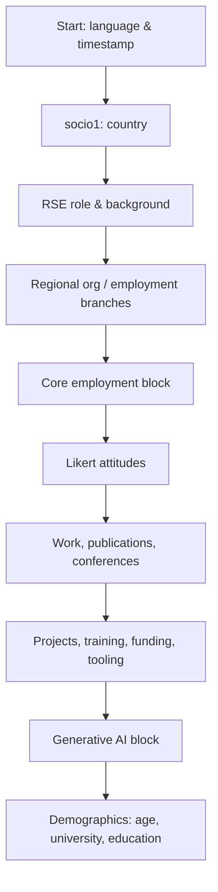

# International RSE Survey 2026 — Survey Process

This document describes how the 2026 survey is structured in the raw data: the order in which questions appear, how respondents are routed to country- or answer-specific follow-ups, and how the analysis pipeline filters responses before reporting.

It is derived from `RSE_survey_2026_data/2026_tf.csv` (column order and response patterns) and `2026_cols.csv` (question text and option labels), together with the filtering logic in `rse-book/R/postprocessing.R`.

---

## Data sources

| File | Role |
|------|------|
| `2026_tf.csv` | One row per respondent; column order reflects the survey flow used in this book |
| `2026_cols.csv` | Maps each column code (`New_name`) to question text and multi-select option labels |
| `2026_merged.csv` | Extended export with additional demographic/salary columns not present in `2026_tf.csv` |

The analysis book reads only `2026_tf.csv` and `2026_cols.csv`.

---

## Respondent filtering (analysis pipeline)

Before any question is analysed, respondents pass through two filters implemented in `filter_survey_respondents()` / `load_filtered_tf()`:

### 1. Submission filter (global)

| Rule | Field | Criterion |
|------|-------|-----------|
| Include | `submitdate_0` | Non-empty timestamp |
| Exclude | `submitdate_0` | Empty (partial / abandoned sessions) |

**2026 totals:** 1,164 rows in the export; **759 submitted**, **405 partial** excluded.

Partial responses typically contain only early answers and would distort percentages if included.

### 2. Country filter (configurable)

| Rule | Field | Criterion |
|------|-------|-----------|
| Include | `socio1_0` | Value is in the configured `FILTER` |

`FILTER` is set in `rse-book/R/.config`. Example for Nordic analyses:

```r
FILTER = c("Finland", "Norway", "Sweden", "Denmark", "Iceland", "Estonia")
```

The same filter can be overridden per function call (`filter = ...`).

### 3. Question-level N (per analysis)

Even after the two filters above, **N varies by question** because:

- Conditional questions were not shown to every respondent
- Respondents may skip optional items
- Multi-select and free-text fields may be left blank

Percentages in the book are computed from the number of respondents who actually answered that question.

### 4. Free-text recoding filter (downstream)

For typed answers, an additional filtering step applies during analysis:

1. Split comma-separated entries, lowercase, trim, de-duplicate
2. Apply per-chapter regex recode maps (first match wins)
3. Drop entries mapped to `NA` (excluded patterns such as blank, “n/a”, nonsense)

Excluded tokens do not appear in summary tables; see the Recoding appendix in the book for the full allocation audit trail.

---

## Survey flow overview

The survey opens with **country selection**, then covers role, employment, attitudes, tooling, training, funding, generative AI, and demographics. Questions are grouped below by topic. The **#** column matches the order of first appearance in `2026_tf.csv`.



---

## Question order (110 question groups)

Each row is one **question code** (the stem before `[...]_0` suffixes). Multi-select and Likert items share one code but have many columns.

### Opening & screening

| # | Code | Type | Question |
|---|------|------|----------|
| 1 | `startlanguage` | Single | Start language |
| 2 | `startdate` | Single | Date started |
| 3 | `socio1` | Single | In which country do you work? |

### RSE role & background

| # | Code | Type | Question |
|---|------|------|----------|
| 4 | `rse1` | Single | Do you write software for academic research as part of your job? |
| 5 | `edu2` | Single | In which discipline is your highest academic qualification? |
| 6 | `rse3` | Single | Who uses the code that you write? |
| 7 | `soft2can` | Single | Do you consider yourself a professional software developer? |
| 8 | `soft1can` | Single | How many years of software development experience do you have? |
| 9 | `open1de` | Single | Do you have an ORCID ID? |
| 10 | `rse4de` | Single | Does the majority of your role comprise leading a group of software developers or RSEs? |
| 11 | `ukrse1` | Single | Are you a member of any RSE associations? |

> **Note on suffixes:** Many codes end in `can`, `de`, or `zaf` for historical reasons from earlier national surveys. In 2026 several of these items are shown **globally** (e.g. `soft1can`, `tool4can`, `proj5zaf`), not only to Canada, Germany, or South Africa. True geographic routing is indicated in the [Regional & conditional questions](#regional--conditional-questions) section below.

### RSE organisation (with regional branches)

| # | Code | Type | Audience | Question |
|---|------|------|----------|----------|
| 12 | `org1can` | Single | Global | Would you be interested in joining such an organisation? |
| 13 | `org1cz` | Single | Czech Republic | Would you be interested in joining a national Czech RSE association? |
| 14 | `org1swiss` | Single | Switzerland | Would you be interested in joining a national Swiss RSE association? |
| 15 | `org2can` | Multi | Follow-up | What would you hope to get out of such an organisation? |
| 16 | `ukrse12sa` | Single | South Africa | Would you like to attend a multidisciplinary RSE conference in South Africa? |
| 17–19 | `org3us`–`org5us` | Single | United States | US association activities, membership value, fee willingness |
| 20 | `proj6uk` | Single | United Kingdom | Coding habits: RSE vs non-RSE self-identification |
| 21 | `org3nord` | Multi | Nordics | How could Nordic-RSE foster community engagement? |
| 22 | `org4nord` | Multi | Nordics | What should Nordic-RSE focus on? |

**Branching observed in data:**

- `org2can` is answered by respondents who expressed interest (`org1can = True`) or are existing association members (`ukrse1`); n=386 among submitted responses
- `org3nord` / `org4nord` only receive answers from Nordic countries (n=62 each among submitted Nordics)

### Employment — organisation type (country-specific variants)

| # | Code | Audience |
|---|------|----------|
| 23 | `currentEmp1` | Default (non-regionalised path) |
| 24 | `currentEmp1qde` | Germany |
| 25 | `currentEmp1qswiss` | Switzerland |
| 26 | `currentEmp1nl` | Netherlands |
| 27 | `currentEmp11qcl` | Chile (QCL path) |
| 28–29 | `currentEmp1qzaf`, `currentEmp11qzaf` | South Africa |

Only one organisation-type variant is shown per respondent, based on `socio1_0`.

### Employment — institute follow-ups (Germany & US)

| # | Code | Shown when |
|---|------|------------|
| 30 | `currentEmp20deqde` | Germany — Fraunhofer institute selected |
| 31 | `currentEmp20qus` | United States — national laboratory selected |
| 32 | `currentEmp21deqde` | Germany — Helmholtz centre |
| 33 | `currentEmp22deqde` | Germany — Leibniz institute |
| 34 | `currentEmp23deqde` | Germany — Max Planck institute |
| 35 | `currentEmp24deqde` | Germany — University of Applied Sciences |

### Previous employment (parallel regional variants)

| # | Code | Audience |
|---|------|----------|
| 36 | `prevEmp1` | Default |
| 37 | `prevEmp1qde` | Germany |
| 38 | `prevEmp1nl` | Netherlands |
| 39 | `prevEmp1qswiss` | Switzerland |

### Core employment details

| # | Code | Type | Question |
|---|------|------|----------|
| 40 | `currentEmp5` | Single | What is your official job title? |
| 41 | `currentEmp6` | Single | Are you known in your group by a different job title? |
| 42 | `currentEmp60` | Single | Please enter the job title you use. |
| 43 | `currentEmp12` | Single | Do you work full time or part time? |
| 44 | `currentEmp10` | Multi | What is the nature of your current employment? |
| 45 | `currentEmp11` | Single | Expected duration (years) of current position |
| 46 | `currentEmp13` | Multi | Discipline(s) in which you work |

**Branching:** `currentEmp60` follows `currentEmp6 = True` (97% of those who answered “yes” also provided an alternate title).

### Likert scales — time allocation & attitudes

| # | Code | Sub-items |
|---|------|-----------|
| 47 | `likert0` | Actual time spent on: developing software, research, management, teaching, other |
| 48 | `likert1` | Desired time on the same five activities |
| 49 | `likert3a` | Satisfied with current position |
| 50 | `likert3b` | Satisfied with career |
| 51 | `likert4a` | Contribution recognised by institution |
| 52 | `likert4b` | Recognised by institution; recognised by supervisor |
| 53 | `likert4c` | Recognised by institution; supervisor; researchers worked with |
| 54 | `likert5b` | Labour-market demand; promotion process clarity; next role likely RSE |
| 55 | `likert5a` | Ease of finding equivalent job; promotion likelihood; career opportunities |

Likert items use a 5-point agreement scale (Strongly disagree → Strongly Agree) or percentage buckets for `likert0`/`likert1`.

### South Africa — turnover block

| # | Code | Audience |
|---|------|----------|
| 56 | `turnOver3` | Global item (Likert-style) |
| 57 | `turnOver3zaf` | South Africa — main challenges in developing research software |
| 63 | `turnOver4zaf` | South Africa — types of research software developed |

### Germany — research software institution

| # | Code | Audience |
|---|------|----------|
| 58 | `org3de` | Germany — support for a national research software institution |
| 59 | `org4de` | Germany — tasks for such an institution |
| 60 | `org5de` | Germany — preferred institutional structure |
| 61 | `org6de` | Germany — community engagement mechanisms |
| 62 | `org7de` | Germany — further suggestions (free text) |

### Work activities & publications

| # | Code | Type | Question / audience |
|---|------|------|---------------------|
| 64 | `currentWork2` | Single | Part of a dedicated research software group? |
| 65 | `currentWork1` | Single | Always same researchers or regularly changing? |
| 66 | `currentWork2qcl` | Multi | Who are you writing code for? (Chile + Nordics path; n=69) |
| 67 | `paper3mod` | Single | Published a paper about your software? |
| 68 | `paper2mod` | Multi | Acknowledged in papers when software contributes? |
| 72 | `currentWork3nord` | Single | Network of peers beyond close colleagues (Nordics; n=58) |

### Conferences & referencing

| # | Code | Branching |
|---|------|-----------|
| 69 | `conf1can` | Have you presented software at a conference? |
| 70 | `conf2can` | Which conference(s)? — shown when `conf1can = True` (327/408 yes; 80%) |
| 71 | `ref1uk` | UK only — intending to submit software for REF 2029? (n=126) |

### Project management & open science

| # | Code | Notes |
|---|------|-------|
| 73 | `proj1can` | Number of software projects involved in |
| 74–75 | `stability1`, `stability2` | Developer attrition risk & succession planning |
| 76–77 | `proj8can`, `proj7can` | Project manager presence; % dedicated developers |
| 78 | `proj4can` | Software testing practices (multi-select) |
| 79 | `open1can` | Open-source licensing frequency |
| 80–81 | `likert2a`, `likert2b` | Reference software directly vs via paper; DOI generation |
| 82 | `proj5zaf` | Version control tools (global in 2026) |
| 83 | `proj6zaf` | Collaboration tools (global in 2026) |
| 84 | `proj5can` | Development methodology |

### Training & skills

| # | Code | Branching |
|---|------|-----------|
| 85 | `train2` | Times per year providing training |
| 86 | `train4qzaf` | South Africa — training attendance frequency |
| 87 | `train3` | Training programs involved with (free text) |
| 88 | `train4` | Teach or support credit-bearing modules? |
| 89 | `train5` | Capacity of contribution — follows `train4 = True` (100%) |
| 99 | `ukrse3` | How RSE skills were learned (multi-select) |
| 100 | `skillNord` | Nordics — time granted for professional development |
| 101 | `skill2` | Three skills to acquire or improve (free text) |

### Funding

| # | Code | Audience |
|---|------|----------|
| 90 | `fund3` | Sources paying RSE effort (multi-select, global) |
| 91 | `fund1can` | Canada — how research software work is funded |
| 92 | `fund3qnl` | Netherlands — grant types |
| 93 | `fund1uk` | UK — applied for external grants as PI |
| 94 | `fund1nord` | Nordics — access to RSE-specific grants |

### Tooling

| # | Code | Notes |
|---|------|-------|
| 95 | `tool5` | Deployment platforms (global) |
| 96 | `tool5can` | Canada-specific deployment question |
| 97 | `tool2` | Primary development operating system |
| 98 | `tool4can` | Programming languages used (global in 2026) |

### Generative AI

| # | Code | Branching |
|---|------|-----------|
| 102 | `genAI1` | Frequency of generative AI use |
| 103 | `genAI2` | Purposes of use — skipped when `genAI1 = Never` (0/124) |
| 104 | `genAI3` | Which tools — same condition as `genAI2` |
| 105 | `genAI4` | Expected effect on RSE demand (5 years) |
| 106 | `genAI5` | Expected effects on productivity, quality, job security |
| 107 | `genAI6` | Skills needed to use generative AI effectively |

### Closing demographics

| # | Code | Question |
|---|------|----------|
| 108 | `socio3` | Age |
| 109 | `currentEmp2q` | Which university do you work for? (free text) |
| 110 | `edu1` | Highest level of education attained |

Additional demographic and salary fields exist in `2026_merged.csv` (`socio2`, disability, ethnicity, salary by region) but are **not** included in `2026_tf.csv` used by the analysis book.

---

## Regional & conditional questions

The table below lists questions that are **geographically restricted** or **answer-conditional**, inferred from which countries actually answered among submitted responses (n=759).

### Geographic routing (by `socio1_0`)

| Code | Intended audience | Submitted n |
|------|-------------------|-------------|
| `org1swiss` | Switzerland | 59 |
| `org3us`, `org4us`, `org5us` | United States | 45–58 |
| `org3nord`, `org4nord` | Finland, Norway, Sweden, Denmark, Iceland, Estonia | 62 each |
| `org3de`–`org7de`, `org4de`, `org5de`, `org6de` | Germany | 33–206 |
| `currentEmp1qde`, `prevEmp1qde` | Germany | 206 / 194 |
| `currentEmp1qswiss`, `prevEmp1qswiss` | Switzerland | 66 each |
| `currentEmp1nl`, `prevEmp1nl` | Netherlands | 50 each |
| `currentEmp11qcl` | Chile | 7 |
| `currentEmp1qzaf`, `turnOver3zaf`, `turnOver4zaf`, `train4qzaf`, `ukrse12sa` | South Africa | 38–42 |
| `currentWork2qcl` | Chile + Nordics | 69 |
| `currentWork3nord`, `fund1nord`, `skillNord` | Nordics | 58–60 |
| `ref1uk`, `fund1uk`, `proj6uk` | United Kingdom | 54–126 |
| `fund1can`, `tool5can` | Canada | 12 each |
| `fund3qnl` | Netherlands (grant follow-up) | 23 |

### Answer-conditional follow-ups

| Trigger | Follow-up | Condition |
|---------|-----------|-----------|
| `conf1can = Yes` | `conf2can` | Which conferences (80% of yes answered) |
| `org1can = Yes` or RSE association member | `org2can` | Benefits sought from an organisation |
| `currentEmp6 = Yes` | `currentEmp60` | Alternate job title (97%) |
| `genAI1 ≠ Never` | `genAI2`, `genAI3` | Purposes and tools (0% answered when Never) |
| `train4 = Yes` | `train5` | Teaching contribution capacity (100%) |
| Organisation type (Germany) | `currentEmp20deqde`–`currentEmp24deqde` | Institute-specific follow-ups |
| Organisation type (US) | `currentEmp20qus` | National laboratory list |

### Screening question (`rse1`)

`rse1` asks whether the respondent writes software for academic research. Among submitted responses: **709 True**, **50 False**. Both groups continue through the survey; `rse1` is informational rather than a hard screen-out in the exported data.

---

## Analysis workflow (book chapters)

Each chapter in `rse-book/` follows the same pipeline:

1. **Load** `2026_tf.csv`
2. **Filter** to submitted rows with `socio1_0 ∈ FILTER`
3. **Select columns** for one question code (exact match or `code[...]_0` sub-columns)
4. **Decode** values: multi-select `"True"`/`"False"` → option labels from `2026_cols.csv`; single Yes/No `"True"`/`"False"` → `"Yes"`/`"No"`
5. **Visualise** multi-select answers as heatmaps; recode free text via chapter-specific regex maps
6. **Cache** raw-to-category allocation tables for the Recoding appendix

Chapter order in `_quarto.yml` follows **thematic parts** (Conferences, Employment, Likert scales, …), not the live survey order above.

---

## Sample sizes (submitted responses)

| Scope | n |
|-------|---|
| All countries | 759 |
| Germany | 206 |
| United Kingdom | 127 |
| United States | 93 |
| Switzerland | 66 |
| Nordics (6 countries) | 62 |
| Netherlands | 50 |
| South Africa | 42 |
| Canada | 12 |

Partial responses excluded from these counts: 405 globally (10 in Nordics).

---

*See also [`survey-process-nordics.md`](survey-process-nordics.md) for the Nordic-focused flow with per-question **N**.*
